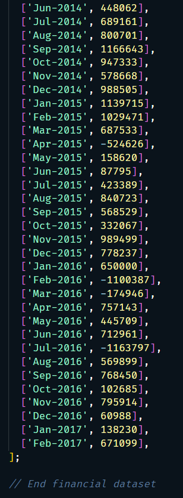

# console-finances

## Description

In this challenge, I used basic JavaScript skills like for loops, if statements, concatenation, arrays, declarations, and initialization to analyse a company's financial records. Check out how I approached this real-world task using JavaScript. Feel free to follow along and learn!

## Table of Contents (Optional)

If your README is long, add a table of contents to make it easy for users to find what they need.

-   [Installation](#installation)
-   [Usage](#usage)
-   [Credits](#credits)
-   [List of third-party assets](#list-of-third-party-assets)
-   [License](#license)

## Installation

N/A

## Usage

You can view the website via this link: https://francis-gomes-esq.github.io/console-finances/

-   
-   
-   
-   
-   
-   
-   
-   

## Credits

-   Benefited from the discussion between a student and TA during a breakout session.
-   Kudos to Rhen. He answered my questions repeatedly on Slack.

## List of third-party assets.

-   https://www.w3schools.com/js/
-   https://stackoverflow.com/questions/2970314/a-beginners-guide-to-learning-javascript

## License

Please refer to the repo.
